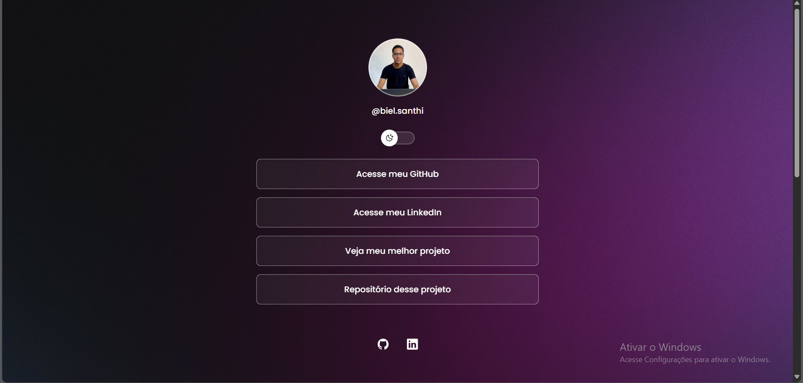

# LuizLinks

**LuizLinks** é uma adaptação pessoal feita a partir de um projeto desenvolvido durante o programa **Discover da Rocketseat**. A ideia é reunir, de forma simples e direta, os meus principais links em uma única página. Apesar de ter sido feito com foco no meu uso, o código é totalmente reutilizável e pode ser facilmente adaptado por qualquer pessoa que queira criar sua própria página de links estilo “link na bio”.

## ✨ Funcionalidades

- Layout responsivo e minimalista  
- Organização prática de links pessoais, sociais ou profissionais  
- Fácil de personalizar (código limpo e direto)  
- Pode ser usado como página de perfil ou link central em redes sociais
- Alternância entre modo claro e escuro com um clique (light/dark mode)


## 🛠 Tecnologias

- HTML5  
- CSS3  
- JavaScript  

## 📸 Prévia




## 🚀 Como usar

1. Clone este repositório:

   ```bash
   git clone https://github.com/LuizSanti/luizlinks.git
Edite o arquivo index.html com seus próprios links, textos e informações.

Personalize o estilo no style.css se quiser mudar cores, fontes ou layout.

Abra o index.html no navegador para visualizar a página.

## 🌐 Hospedagem no GitHub Pages
Você pode hospedar gratuitamente essa página:

Vá até as Configurações do repositório.

Acesse a aba Pages.

Selecione a branch main e a pasta raiz (/).

O GitHub vai gerar um link para acessar seu site.

## 📚 Créditos
Este projeto foi baseado em um desafio do programa Discover da Rocketseat e adaptado por mim com os meus próprios links e ajustes de estilo.

## 👤 Autor
Desenvolvido e adaptado por Luiz Gabriel.
